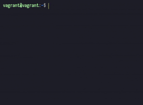

# Logs Analysis Project

*Udacity - Full Stack Web Developer Nanodegree*

> A simple command line utility to execute PSQL queries and print the
  response to the three project questions listed below

### basic example

```
$ question 1
```
will produce...
```
1. What are the most popular three articles of all time?

    SELECT
      title,
      hits
    FROM top_articles
    LIMIT 3;

 title                            |   hits
----------------------------------+--------
 Candidate is jerk, alleges rival | 338647
 Bears love berries, alleges bear | 253801
 Bad things gone, say good people | 170098

 SELECT 3
```

<hr>

## Table of Contents
- **[Questions](#questions)**
- **[How to Install](#how-to-install)**
  - [Requirements](#requirements)
- **[Usage](#usage)**
- **[API](https://github.com/klazich/news/wiki/API#newspy)**
  - [news.py](https://github.com/klazich/news/wiki/API#newspy)
  - [utils_news.py](https://github.com/klazich/news/wiki/API#utils_newspy)
  - [interface.py](https://github.com/klazich/news/wiki/API#interfacepy)

<hr>

## [Questions](#questions)

1. What are the most popular three articles of all time?
2. Who are the most popular article authors of all time?
3. On which days did more than 1% of requests lead to errors?

## [How to Install](#how-to-install)
> **NOTE:** *It is assumed that the "news" database has been created
             and the data loaded from newsdata.sql*
### [Requirements](#requirements)
- [click](http://click.pocoo.org/6/)
- [psycopg2](https://pypi.python.org/pypi/psycopg2)
- [pygments](http://pygments.org/)
- [tabulate](https://pypi.python.org/pypi/tabulate)

**Before logging into the VM, create a new directory, `news` in the
directory shared with the VM, `vagrant` and clone the repo.**
```
$ git clone https://github.com/klazich/news.git news
```

**Next, login to the VM and move to the new directory news:**
```
$ vagrant ssh
$ cd /vagrant/news
```

**Install the CLI with `pip`:**
```
$ pip install -e .
```

## [Usage](#usage)
`question [--list-only | -l] [--views | -v] [<number>]`

### Command
#### `question`
Takes one argument: 1, 2 or 3 corresponding to the questions listed
above. The printed response is in 4 parts:
  - The question,
  - then the query to be executed,
  - a table with the results,
  - and the status.

### Options
#### `--views`, `-v`
Prints the contents of [views.sql](views.sql) to the console. These are
the views that are created before executing queries.
#### `--list-only`, `-l`
Prints the question and the query and exits before running the query.

### Examples
- To execute the query for question 2, run: `question 2`.
- To see the psql views for this project, run: `question --views`.
- To see what question 3 is and what query will be used but don't want
  to touch the DB, run `question --list-only 3`.
